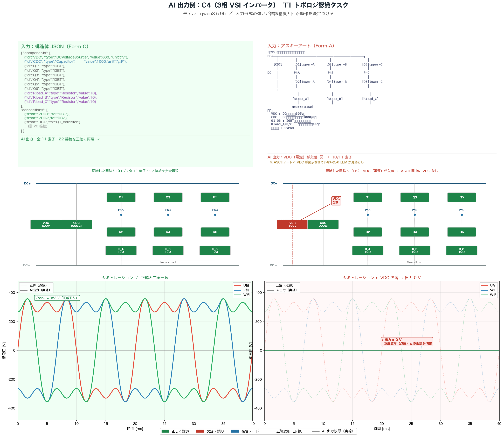

# 予備実験：LLMによる回路認識・生成における入力形式依存性の定量評価

> 実施日：2026-04-30  
> モデル：qwen3.5:4b（72試行）, qwen3.5:9b（108試行）  
> 合計：180試行

---

## フォルダ構成

```
予備実験/
├── 01_実験計画/        実験計画書・結果報告書（Markdown）
├── 02_回路定義/        C1〜C4 の回路 JSON 定義（正解データ含む）
├── 03_入力形式/        Form-A/B/C の変換定義
├── 04_実験スクリプト/  実験・評価・可視化スクリプト（Python）
├── 05_実験結果/        評価済み JSON（raw/ に生データ）
├── 06_図表/            生成された全図（fig01〜fig08 + 回路図・波形）
└── logs/               セキュリティログ等
```

---

## 実験概要

4種類のパワーエレクトロニクス回路を、3種類の入力形式でLLMに与え、**回路認識・数値解析・回路生成**の精度を定量比較した。

### 対象回路

| ID | 回路名 | 難易度 | 素子数 | ノード数 |
|----|--------|:------:|:------:|:--------:|
| C1 | 直列RLC回路 | ★☆☆☆ | 4 | 4 |
| C2 | H-bridgeインバータ | ★★★☆ | 6 | 6 |
| C3 | Buckコンバータ | ★★☆☆ | 5 | 5 |
| C4 | 3相VSIインバータ | ★★★★ | 9 | 8 |

### 入力形式

| 記号 | 形式 | 説明 |
|------|------|------|
| Form-A | アスキーアート | 文字で描いた回路図 |
| Form-B | 自然言語記述 | コンポーネントメタデータ＋自然言語接続記述 |
| Form-C | 構造体JSON | コンポーネント配列＋接続配列の明示的構造 |

### タスク

| 記号 | タスク | 内容 |
|------|--------|------|
| T1 | トポロジ認識 | 入力形式から回路構造を再現する |
| T2 | 数値解析 | 共振周波数・インピーダンス等を計算する |
| T3 | 回路生成 | 仕様文から回路を生成する |

---

## 精度指標の定義

### CR：コンポーネント識別率（Component Recognition Rate）

```
CR = 正しく識別したコンポーネント数 / 正解の全コンポーネント数
```

- 素子の種類・値（±10%以内）が一致した場合に1点
- CR = 1.0 が理想（全素子を完全識別）
- **Form-A/B/C の差が小さい粗い指標**（CR だけでは形式依存性が見えにくい）

---

### CA：接続正確度（Connection Accuracy）

```
CA = 正しく識別した接続エッジ数 / 正解の全接続エッジ数
```

- 無向グラフとして比較（A-B = B-A）
- CA = 1.0 が理想
- CR 同様、3形式でほぼ差なし（全形式で ≈ 1.00）

---

### TE：トポロジ完全一致率（Topology Exact-match Rate）  ★最重要指標

```
TE = 1  if CR = 1.0 AND CA = 1.0 （完全一致）
TE = 0  otherwise
（3試行の平均でスコア化）
```

- CR・CA の AND 条件のため、**1つでも誤りがあれば TE = 0**
- 回路設計では接続の部分的ミスが致命的になるため、この厳密な指標が本質的
- **Form-C（JSON）が全回路・全モデルで TE = 1.00 を達成**

**TE 結果（2モデル平均）：**

| 回路 | Form-A (ASCII) | Form-B (自然言語) | Form-C (JSON) |
|------|:--------------:|:-----------------:|:-------------:|
| C1 直列RLC | 1.00 | 1.00 | **1.00** |
| C2 H-bridge | 0.40 | 0.00 | **1.00** |
| C3 Buckコンバータ | 0.80 | 1.00 | **1.00** |
| C4 3相VSI | **0.00** | 0.40 | **1.00** |
| **全平均** | 0.55 | 0.60 | **1.00** |

> **Form-A（アスキーアート）は C4（3相VSI：9素子・7ノード）で TE=0.00。**  
> 複雑な回路では ASCII 表現の空間的解釈が根本的に破綻することを定量的に実証。

---

### NA：数値正確度（Numerical Accuracy）

```
NA = 1  if |計算値 - 正解| / |正解| < 0.05（誤差5%以内）
NA = 0  otherwise（計算不能・計算誤り）
```

- T2（数値解析タスク）のみで使用
- 共振周波数・インピーダンス・デューティ比・変調指数などを評価
- **Form-B（自然言語）が全回路平均で最高（NA = 0.92）**

**NA 結果（2モデル平均）：**

| 回路 | Form-A | Form-B | Form-C |
|------|:------:|:------:|:------:|
| C1 直列RLC | 0.33 | **1.00** | 0.50 |
| C2 H-bridge | 0.83 | **0.83** | 0.67 |
| C3 Buckコンバータ | 0.33 | **0.83** | 0.50 |
| C4 3相VSI | 0.33 | **1.00** | 0.33 |
| **全平均** | 0.46 | **0.92** | 0.50 |

> Form-B が高い理由：自然言語記述に「共振周波数約503Hz」などの計算ヒントが含まれており、  
> LLMの既知パターンマッチングが機能しやすいため。

---

### VS：生成妥当性スコア（Validity Score）

```
VS = 0.4 × 仕様充足率 + 0.4 × 構造的妥当性 + 0.2 × 数値妥当性
```

- T3（回路生成タスク）のみで使用
- 3形式ともに高水準（0.85〜0.95）で、生成タスクでは形式依存性が小さい

---

## 主要知見

### H1（構造化JSON優位性）：支持

Form-C（構造体JSON）は TE において Form-A 比で **平均 +45 ポイント**（0.55 → 1.00）。  
「コンポーネント配列＋接続配列」という明示的構造が、LLMの空間的解釈への依存を排除する。

### H2（T1-T2 非対称性）：支持

Form-C 条件下で T1 認識 TE=1.00 に対し T2 解析 NA=0.50 という顕著な非対称性が確認された。

| 形式 | T1 TE | T2 NA | 差（NA − TE） |
|------|:-----:|:-----:|:-------------:|
| Form-A | 0.55 | 0.46 | −0.09 |
| Form-B | 0.60 | **0.92** | +0.33 |
| Form-C | **1.00** | 0.50 | **−0.50** |

> 「トポロジ認識の課題は Form-C で解決できるが、電気的特性の精密計算は別の能力を要する」

---

## 図表一覧（06_図表/）

### ★ 主要図：入力形式の違いによる成功例 vs 失敗例



**C4（3相VSI）× T1（トポロジ認識）での入力形式比較（qwen3.5:9b）**

| | Form-C（構造体JSON）| Form-A（アスキーアート）|
|---|---|---|
| AI出力 | 全11素子・22接続を完全再現 | VDC（電源）欠落 → 10/11素子 |
| シミュレーション結果 | 3相50Hz 正弦波 ✓ | 出力電圧 = 0V ✗ |
| スコア | CR=1.00 / CA=1.00 / **TE=1.00** | CR=0.91 / CA=1.00 / **TE=0.00** |

> 素子の欠落が1個でもあれば制御回路として動作しない（TE=0）という厳しい現実を示す。この図が「構造体JSONの優位性」と「HILによる数値検証の必要性」を同時に直感的に示す本実験の核心図。

### 精度評価図（メイン）

| ファイル名 | 内容 | 見どころ |
|-----------|------|----------|
| `example_success_vs_failure.png` | **★成功例 vs 失敗例 比較図（最重要）** | C4×Form-C=TE1.00（正弦波）vs C4×Form-A=TE0.00（0V出力） |
| `fig03_TE_heatmap.png` | **TE ヒートマップ（回路×形式）** | C4×Form-A = 0.00（赤）、Form-C 列が全て緑 |
| `fig04_T2_vs_T1.png` | **T1認識 vs T2解析 非対称性** | Form-C: T1=1.0 >> T2=0.5 の落差 |
| `fig08_summary_heatmap.png` | **全指標サマリー（形式×指標）** | 5指標を一枚で俯瞰、Form-B/C のトレードオフ |
| `fig05_radar_chart.png` | 総合評価レーダーチャート | Form-C（緑）が TE 軸で最大、Form-B（橙）が NA 軸で最大 |
| `fig06_NA_heatmap.png` | NA ヒートマップ（T2解析） | Form-B 列が全回路で最高 |
| `fig01_CR_by_form.png` | CR 棒グラフ（エラーバー付き） | 形式間の差は小さい（粗い指標の確認） |
| `fig02_CA_by_form.png` | CA 棒グラフ | 全形式でほぼ 1.00 |
| `fig07_elapsed_time.png` | 応答時間ボックスプロット | Form-B が最も分散大、Form-C が安定して速い |

### 回路図（回路定義の可視化）

| ファイル名 | 内容 |
|-----------|------|
| `circuit_C1_series_RLC.png` | 直列RLC回路 回路図 |
| `circuit_C2_hbridge.png` | H-bridge インバータ 回路図 |
| `circuit_C3_buck.png` | Buck コンバータ 回路図 |
| `circuit_C4_3phase_VSI.png` | 3相VSI インバータ 回路図 |

### シミュレーション波形

| ファイル名 | 内容 |
|-----------|------|
| `sim_C1_series_RLC.png` | インピーダンス-周波数特性 + ステップ応答（$f_0$=1592 Hz, Q=1.00）|
| `sim_C2_hbridge.png` | PWM出力波形 + LCフィルタ後正弦波（$f_{out}$=50 Hz）|
| `sim_C3_buck.png` | 出力電圧・インダクタ電流過渡応答（$V_{in}$=24V → $V_{out}$=12V）|
| `sim_C4_3phase_VSI.png` | 3相出力電圧・線間電圧波形（300V DC → 3相50Hz）|

---

## 再現方法

```bash
# 1. 実験実行（Ollama + qwen3.5 が起動済みであること）
cd 04_実験スクリプト
python3 run_experiment.py

# 2. 評価・集計
python3 evaluate.py ../05_実験結果/raw/results_*.json

# 3. 精度指標の可視化（fig01〜fig08）
python3 visualize.py ../05_実験結果/evaluated_merged_*.json

# 4. 回路図生成（schemdraw が必要: pip install schemdraw）
python3 draw_circuits.py

# 5. シミュレーション波形生成（scipy が必要）
python3 simulate_circuits.py
```

